# TramAI 0.6.0 — Module Dependency Graph

> **Baseline:** `v0.5.0` (`5d0ad69bb547223f8a5c8639b8398276d35eea50`)
> **Source:** `build/reports/maintainability/module-dependencies.json`
> **Schema version:** 1

This document is generated as a complete unit by `generateModuleDependencyGraph`.

## Module Inventory

| Module | Gradle path | Layer | Publishable |
|---|---|---|---:|
| `approval-resume` | `:examples:approval-resume` | applications-examples | yes |
| `governed-workflow` | `:examples:governed-workflow` | applications-examples | yes |
| `sovereign-document-intelligence` | `:examples:sovereign-document-intelligence` | applications-examples | yes |
| `sovereign-offline-verification` | `:examples:sovereign-offline-verification` | applications-examples | yes |
| `spring-sovereign-starter` | `:examples:spring-sovereign-starter` | applications-examples | yes |
| `support-agent` | `:examples:support-agent` | applications-examples | yes |
| `tool-governance` | `:examples:tool-governance` | applications-examples | yes |
| `tramai-anthropic` | `:tramai-anthropic` | provider-adapters | yes |
| `tramai-azure-openai` | `:tramai-azure-openai` | provider-adapters | yes |
| `tramai-bedrock` | `:tramai-bedrock` | provider-adapters | yes |
| `tramai-bom` | `:tramai-bom` | provider-adapters | yes |
| `tramai-core` | `:tramai-core` | core-contracts | yes |
| `tramai-dashboard` | `:tramai-dashboard` | provider-adapters | no |
| `tramai-deepseek` | `:tramai-deepseek` | provider-adapters | yes |
| `tramai-embedding` | `:tramai-embedding` | provider-adapters | yes |
| `tramai-engine` | `:tramai-engine` | runtime-execution | yes |
| `tramai-gemini` | `:tramai-gemini` | provider-adapters | yes |
| `tramai-mcp` | `:tramai-mcp` | provider-adapters | yes |
| `tramai-memory` | `:tramai-memory` | provider-adapters | yes |
| `tramai-memory-store` | `:tramai-memory-store` | provider-adapters | yes |
| `tramai-observability` | `:tramai-observability` | provider-adapters | yes |
| `tramai-ollama` | `:tramai-ollama` | provider-adapters | yes |
| `tramai-openai` | `:tramai-openai` | provider-adapters | yes |
| `tramai-orchestration` | `:tramai-orchestration` | runtime-execution | yes |
| `tramai-persistence-file` | `:tramai-persistence-file` | provider-adapters | yes |
| `tramai-persistence-jdbc` | `:tramai-persistence-jdbc` | provider-adapters | yes |
| `tramai-platform` | `:tramai-platform` | provider-adapters | yes |
| `tramai-rag` | `:tramai-rag` | provider-adapters | yes |
| `tramai-scheduler` | `:tramai-scheduler` | runtime-execution | yes |
| `tramai-security` | `:tramai-security` | governance | yes |
| `tramai-server` | `:tramai-server` | provider-adapters | yes |
| `tramai-sovereign` | `:tramai-sovereign` | governance | yes |
| `tramai-spring` | `:tramai-spring` | framework-integrations | yes |
| `tramai-spring-boot-starter-local-provider-openai` | `:tramai-spring-boot-starter-local-provider-openai` | framework-integrations | yes |
| `tramai-spring-boot-starter-sovereign` | `:tramai-spring-boot-starter-sovereign` | framework-integrations | yes |
| `tramai-spring-boot-starter-sovereign-ops` | `:tramai-spring-boot-starter-sovereign-ops` | framework-integrations | yes |
| `tramai-spring-boot-starter-sovereign-ops-actuator` | `:tramai-spring-boot-starter-sovereign-ops-actuator` | framework-integrations | yes |
| `tramai-spring-boot-starter-sovereign-ops-micrometer` | `:tramai-spring-boot-starter-sovereign-ops-micrometer` | framework-integrations | yes |
| `tramai-spring-boot-starter-sovereign-ops-observability` | `:tramai-spring-boot-starter-sovereign-ops-observability` | framework-integrations | yes |
| `tramai-spring-boot-starter-sovereign-ops-rest` | `:tramai-spring-boot-starter-sovereign-ops-rest` | framework-integrations | yes |
| `tramai-spring-boot-starter-sovereign-persistence-file` | `:tramai-spring-boot-starter-sovereign-persistence-file` | framework-integrations | yes |
| `tramai-spring-boot-starter-sovereign-persistence-jdbc` | `:tramai-spring-boot-starter-sovereign-persistence-jdbc` | framework-integrations | yes |
| `tramai-standalone` | `:tramai-standalone` | provider-adapters | yes |
| `tramai-structured` | `:tramai-structured` | core-contracts | yes |
| `tramai-testing` | `:tramai-testing` | provider-adapters | yes |
| `tramai-vectorstore-chroma` | `:tramai-vectorstore-chroma` | provider-adapters | yes |
| `tramai-vectorstore-pgvector` | `:tramai-vectorstore-pgvector` | provider-adapters | yes |
| `tramai-vectorstore-spi` | `:tramai-vectorstore-spi` | provider-adapters | yes |

## Dependency Graph

```mermaid
```mermaid
graph TD
  examplesapproval_resume -->|implementation| tramai_spring
  examplesapproval_resume -->|implementation| tramai_spring_boot_starter_sovereign
  examplesapproval_resume -->|implementation| tramai_spring_boot_starter_sovereign_ops
  examplesapproval_resume -->|implementation| tramai_spring_boot_starter_sovereign_persistence_jdbc
  examplesgoverned_workflow -->|implementation| tramai_orchestration
  examplessovereign_document_intelligence -->|implementation| tramai_core
  examplessovereign_document_intelligence -->|implementation| tramai_engine
  examplessovereign_document_intelligence -->|implementation| tramai_security
  examplessovereign_document_intelligence -->|implementation| tramai_sovereign
  examplessovereign_offline_verification -->|implementation| tramai_core
  examplessovereign_offline_verification -->|implementation| tramai_engine
  examplessovereign_offline_verification -->|implementation| tramai_security
  examplessovereign_offline_verification -->|implementation| tramai_sovereign
  examplesspring_sovereign_starter -->|implementation| tramai_openai
  examplesspring_sovereign_starter -->|implementation| tramai_spring
  examplesspring_sovereign_starter -->|implementation| tramai_spring_boot_starter_local_provider_openai
  examplesspring_sovereign_starter -->|implementation| tramai_spring_boot_starter_sovereign
  examplesspring_sovereign_starter -->|implementation| tramai_spring_boot_starter_sovereign_ops
  examplesspring_sovereign_starter -->|implementation| tramai_spring_boot_starter_sovereign_ops_rest
  examplesspring_sovereign_starter -->|implementation| tramai_spring_boot_starter_sovereign_persistence_jdbc
  examplessupport_agent -->|implementation| tramai_ollama
  examplessupport_agent -->|implementation| tramai_standalone
  examplestool_governance -->|implementation| tramai_bom
  examplestool_governance -->|implementation| tramai_engine
  examplestool_governance -->|implementation| tramai_security
  examplestool_governance -->|implementation| tramai_structured
  tramai_anthropic -->|api| tramai_core
  tramai_azure_openai -->|api| tramai_core
  tramai_bedrock -->|api| tramai_core
  tramai_deepseek -->|api| tramai_core
  tramai_deepseek -->|api| tramai_openai
  tramai_engine -->|api| tramai_core
  tramai_engine -->|implementation| tramai_security
  tramai_gemini -->|api| tramai_core
  tramai_mcp -->|api| tramai_server
  tramai_mcp -->|implementation| tramai_structured
  tramai_memory -->|api| tramai_core
  tramai_memory_store -->|api| tramai_core
  tramai_observability -->|api| tramai_core
  tramai_observability -->|implementation| tramai_orchestration
  tramai_ollama -->|api| tramai_core
  tramai_openai -->|api| tramai_core
  tramai_orchestration -->|api| tramai_core
  tramai_persistence_file -->|api| tramai_core
  tramai_persistence_file -->|api| tramai_engine
  tramai_persistence_file -->|api| tramai_security
  tramai_persistence_jdbc -->|api| tramai_core
  tramai_persistence_jdbc -->|api| tramai_engine
  tramai_persistence_jdbc -->|api| tramai_security
  tramai_platform -->|api| tramai_orchestration
  tramai_platform -->|implementation| tramai_server
  tramai_rag -->|api| tramai_core
  tramai_rag -->|api| tramai_embedding
  tramai_rag -->|api| tramai_vectorstore_spi
  tramai_scheduler -->|api| tramai_orchestration
  tramai_security -->|api| tramai_core
  tramai_server -->|api| tramai_orchestration
  tramai_server -->|implementation| tramai_scheduler
  tramai_sovereign -->|api| tramai_security
  tramai_sovereign -->|api| tramai_standalone
  tramai_spring -->|implementation| tramai_anthropic
  tramai_spring -->|implementation| tramai_ollama
  tramai_spring -->|implementation| tramai_openai
  tramai_spring -->|compileOnly| tramai_security
  tramai_spring -->|api| tramai_standalone
  tramai_spring_boot_starter_local_provider_openai -->|api| tramai_openai
  tramai_spring_boot_starter_sovereign -->|api| tramai_core
  tramai_spring_boot_starter_sovereign -->|api| tramai_security
  tramai_spring_boot_starter_sovereign -->|api| tramai_sovereign
  tramai_spring_boot_starter_sovereign_ops -->|api| tramai_core
  tramai_spring_boot_starter_sovereign_ops -->|implementation| tramai_engine
  tramai_spring_boot_starter_sovereign_ops -->|api| tramai_security
  tramai_spring_boot_starter_sovereign_ops -->|api| tramai_sovereign
  tramai_spring_boot_starter_sovereign_ops -->|api| tramai_spring_boot_starter_sovereign
  tramai_spring_boot_starter_sovereign_ops_actuator -->|api| tramai_spring_boot_starter_sovereign_ops
  tramai_spring_boot_starter_sovereign_ops_micrometer -->|api| tramai_spring_boot_starter_sovereign_ops
  tramai_spring_boot_starter_sovereign_ops_observability -->|api| tramai_spring_boot_starter_sovereign_ops
  tramai_spring_boot_starter_sovereign_ops_rest -->|api| tramai_spring_boot_starter_sovereign_ops
  tramai_spring_boot_starter_sovereign_persistence_file -->|api| tramai_persistence_file
  tramai_spring_boot_starter_sovereign_persistence_file -->|api| tramai_spring_boot_starter_sovereign
  tramai_spring_boot_starter_sovereign_persistence_file -->|api| tramai_spring_boot_starter_sovereign_ops
  tramai_spring_boot_starter_sovereign_persistence_jdbc -->|api| tramai_persistence_jdbc
  tramai_spring_boot_starter_sovereign_persistence_jdbc -->|api| tramai_security
  tramai_spring_boot_starter_sovereign_persistence_jdbc -->|api| tramai_spring_boot_starter_sovereign
  tramai_spring_boot_starter_sovereign_persistence_jdbc -->|api| tramai_spring_boot_starter_sovereign_ops
  tramai_standalone -->|api| tramai_core
  tramai_standalone -->|api| tramai_engine
  tramai_standalone -->|api| tramai_structured
  tramai_structured -->|api| tramai_core
  tramai_testing -->|api| tramai_core
  tramai_vectorstore_chroma -->|api| tramai_vectorstore_spi
  tramai_vectorstore_pgvector -->|api| tramai_vectorstore_spi
```


```

## Dependency Edges

| From | To | Scope |
|---|---|---|
| `:examples:approval-resume` | `:tramai-spring` | implementation |
| `:examples:approval-resume` | `:tramai-spring-boot-starter-sovereign` | implementation |
| `:examples:approval-resume` | `:tramai-spring-boot-starter-sovereign-ops` | implementation |
| `:examples:approval-resume` | `:tramai-spring-boot-starter-sovereign-persistence-jdbc` | implementation |
| `:examples:governed-workflow` | `:tramai-orchestration` | implementation |
| `:examples:sovereign-document-intelligence` | `:tramai-core` | implementation |
| `:examples:sovereign-document-intelligence` | `:tramai-engine` | implementation |
| `:examples:sovereign-document-intelligence` | `:tramai-security` | implementation |
| `:examples:sovereign-document-intelligence` | `:tramai-sovereign` | implementation |
| `:examples:sovereign-offline-verification` | `:tramai-core` | implementation |
| `:examples:sovereign-offline-verification` | `:tramai-engine` | implementation |
| `:examples:sovereign-offline-verification` | `:tramai-security` | implementation |
| `:examples:sovereign-offline-verification` | `:tramai-sovereign` | implementation |
| `:examples:spring-sovereign-starter` | `:tramai-openai` | implementation |
| `:examples:spring-sovereign-starter` | `:tramai-spring` | implementation |
| `:examples:spring-sovereign-starter` | `:tramai-spring-boot-starter-local-provider-openai` | implementation |
| `:examples:spring-sovereign-starter` | `:tramai-spring-boot-starter-sovereign` | implementation |
| `:examples:spring-sovereign-starter` | `:tramai-spring-boot-starter-sovereign-ops` | implementation |
| `:examples:spring-sovereign-starter` | `:tramai-spring-boot-starter-sovereign-ops-rest` | implementation |
| `:examples:spring-sovereign-starter` | `:tramai-spring-boot-starter-sovereign-persistence-jdbc` | implementation |
| `:examples:support-agent` | `:tramai-ollama` | implementation |
| `:examples:support-agent` | `:tramai-standalone` | implementation |
| `:examples:tool-governance` | `:tramai-bom` | implementation |
| `:examples:tool-governance` | `:tramai-engine` | implementation |
| `:examples:tool-governance` | `:tramai-security` | implementation |
| `:examples:tool-governance` | `:tramai-structured` | implementation |
| `:tramai-anthropic` | `:tramai-core` | api |
| `:tramai-azure-openai` | `:tramai-core` | api |
| `:tramai-bedrock` | `:tramai-core` | api |
| `:tramai-deepseek` | `:tramai-core` | api |
| `:tramai-deepseek` | `:tramai-openai` | api |
| `:tramai-engine` | `:tramai-core` | api |
| `:tramai-engine` | `:tramai-security` | implementation |
| `:tramai-gemini` | `:tramai-core` | api |
| `:tramai-mcp` | `:tramai-server` | api |
| `:tramai-mcp` | `:tramai-structured` | implementation |
| `:tramai-memory` | `:tramai-core` | api |
| `:tramai-memory-store` | `:tramai-core` | api |
| `:tramai-observability` | `:tramai-core` | api |
| `:tramai-observability` | `:tramai-orchestration` | implementation |
| `:tramai-ollama` | `:tramai-core` | api |
| `:tramai-openai` | `:tramai-core` | api |
| `:tramai-orchestration` | `:tramai-core` | api |
| `:tramai-persistence-file` | `:tramai-core` | api |
| `:tramai-persistence-file` | `:tramai-engine` | api |
| `:tramai-persistence-file` | `:tramai-security` | api |
| `:tramai-persistence-jdbc` | `:tramai-core` | api |
| `:tramai-persistence-jdbc` | `:tramai-engine` | api |
| `:tramai-persistence-jdbc` | `:tramai-security` | api |
| `:tramai-platform` | `:tramai-orchestration` | api |
| `:tramai-platform` | `:tramai-server` | implementation |
| `:tramai-rag` | `:tramai-core` | api |
| `:tramai-rag` | `:tramai-embedding` | api |
| `:tramai-rag` | `:tramai-vectorstore-spi` | api |
| `:tramai-scheduler` | `:tramai-orchestration` | api |
| `:tramai-security` | `:tramai-core` | api |
| `:tramai-server` | `:tramai-orchestration` | api |
| `:tramai-server` | `:tramai-scheduler` | implementation |
| `:tramai-sovereign` | `:tramai-security` | api |
| `:tramai-sovereign` | `:tramai-standalone` | api |
| `:tramai-spring` | `:tramai-anthropic` | implementation |
| `:tramai-spring` | `:tramai-ollama` | implementation |
| `:tramai-spring` | `:tramai-openai` | implementation |
| `:tramai-spring` | `:tramai-security` | compileOnly |
| `:tramai-spring` | `:tramai-standalone` | api |
| `:tramai-spring-boot-starter-local-provider-openai` | `:tramai-openai` | api |
| `:tramai-spring-boot-starter-sovereign` | `:tramai-core` | api |
| `:tramai-spring-boot-starter-sovereign` | `:tramai-security` | api |
| `:tramai-spring-boot-starter-sovereign` | `:tramai-sovereign` | api |
| `:tramai-spring-boot-starter-sovereign-ops` | `:tramai-core` | api |
| `:tramai-spring-boot-starter-sovereign-ops` | `:tramai-engine` | implementation |
| `:tramai-spring-boot-starter-sovereign-ops` | `:tramai-security` | api |
| `:tramai-spring-boot-starter-sovereign-ops` | `:tramai-sovereign` | api |
| `:tramai-spring-boot-starter-sovereign-ops` | `:tramai-spring-boot-starter-sovereign` | api |
| `:tramai-spring-boot-starter-sovereign-ops-actuator` | `:tramai-spring-boot-starter-sovereign-ops` | api |
| `:tramai-spring-boot-starter-sovereign-ops-micrometer` | `:tramai-spring-boot-starter-sovereign-ops` | api |
| `:tramai-spring-boot-starter-sovereign-ops-observability` | `:tramai-spring-boot-starter-sovereign-ops` | api |
| `:tramai-spring-boot-starter-sovereign-ops-rest` | `:tramai-spring-boot-starter-sovereign-ops` | api |
| `:tramai-spring-boot-starter-sovereign-persistence-file` | `:tramai-persistence-file` | api |
| `:tramai-spring-boot-starter-sovereign-persistence-file` | `:tramai-spring-boot-starter-sovereign` | api |
| `:tramai-spring-boot-starter-sovereign-persistence-file` | `:tramai-spring-boot-starter-sovereign-ops` | api |
| `:tramai-spring-boot-starter-sovereign-persistence-jdbc` | `:tramai-persistence-jdbc` | api |
| `:tramai-spring-boot-starter-sovereign-persistence-jdbc` | `:tramai-security` | api |
| `:tramai-spring-boot-starter-sovereign-persistence-jdbc` | `:tramai-spring-boot-starter-sovereign` | api |
| `:tramai-spring-boot-starter-sovereign-persistence-jdbc` | `:tramai-spring-boot-starter-sovereign-ops` | api |
| `:tramai-standalone` | `:tramai-core` | api |
| `:tramai-standalone` | `:tramai-engine` | api |
| `:tramai-standalone` | `:tramai-structured` | api |
| `:tramai-structured` | `:tramai-core` | api |
| `:tramai-testing` | `:tramai-core` | api |
| `:tramai-vectorstore-chroma` | `:tramai-vectorstore-spi` | api |
| `:tramai-vectorstore-pgvector` | `:tramai-vectorstore-spi` | api |

## Known Cycles

No dependency cycles were detected.

## Verification

Run `./gradlew verifyModuleDependencyGraph` to check the current graph.
