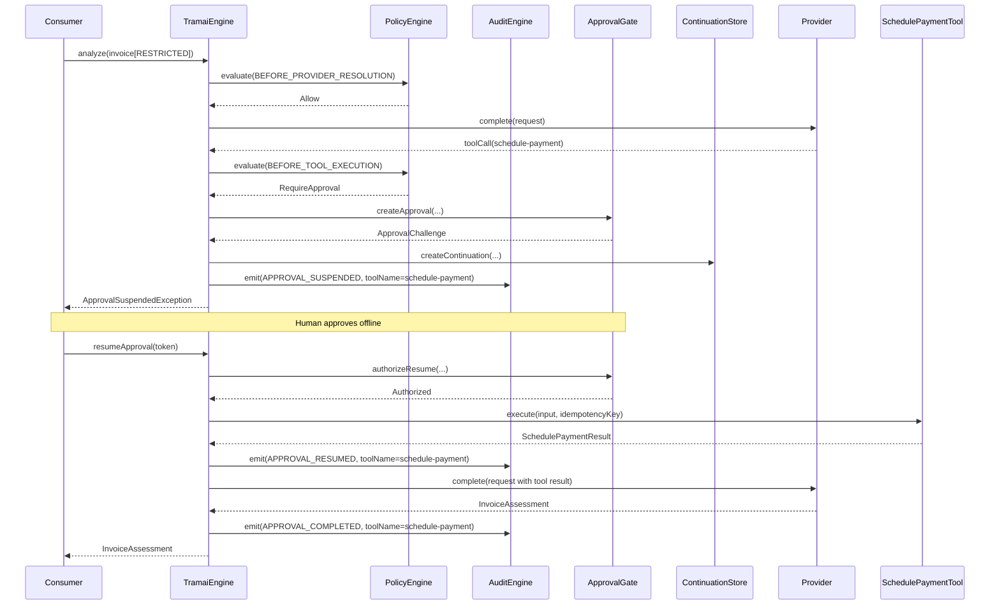

# Sovereign Document Intelligence — Reference Workflow

> **Module:** `examples/sovereign-document-intelligence`
> **Branch:** `feat/sovereign-document-intelligence-reference-workflow`
> **Head SHA:** `e287206657e9ecd9eb53de9751675cf131ef2734`

## Purpose

Demonstrate and integration-test the full sovereign consumer path through
`SovereignTramai.builder().runtime()` in a realistic document-intelligence
scenario: a restricted invoice is analyzed by a local model, a HIGH-risk
payment tool triggers approval suspension, a human operator resumes the
workflow with a bound token, and the payment is executed exactly once.

This workflow serves as:

- **Reference implementation** for sovereign profile consumers
- **Security boundary validation** showing policy enforcement,
  model registry checks, and audit chain integrity
- **Documentation** of the approval lifecycle and replay semantics

## Workflow Sequence

1. **Classification**: Invoice data is wrapped in a
   `ClassifiedDocument(RESTRICTED)` envelope, which triggers
   classification-aware provider routing inside the engine.

2. **Model Resolution**: The engine resolves `local-invoice-model` to the
   `local-provider` via the primary route registered in the builder.

3. **Provider Invocation (Call #1)**: The `DeterministicInvoiceProvider`
   returns a tool call for `schedule-payment`.

4. **Tool Execution Policy Check**: The `DefaultPolicyEngine` evaluates
   `schedule-payment` against the sovereign policy:
   - Tool is allowed (in `allowedTools`)
   - Permission is granted (in `allowedPermissions`)
   - Risk is HIGH with `HUMAN_REQUIRED` approval → **RequireApproval**

5. **Approval Suspension**: The engine:
   - Creates an approval challenge via `ApprovalGateCoordinator`
   - Creates a continuation in `ApprovalContinuationStore` (PENDING)
   - Emits `APPROVAL_SUSPENDED` audit event
   - Throws `ApprovalSuspendedException` to the caller
   - **Tool is NOT executed** (no side effects)

6. **Human Approval** (outside workflow): The operator approves via
   `approvalStore.transition(ApprovalTransition.Approve(...))`.

7. **Resume**: The caller invokes `runtime.resumeApproval(command)` with
   the bound token. The engine:
   - Validates the token binding
   - Calls the tool with the idempotency key from the continuation
   - Emits `APPROVAL_RESUMED` audit event

8. **Provider Invocation (Call #2)**: After tool-result reinjection, the
   provider is called again and returns the final `InvoiceAssessment`.

9. **Completion**: The engine emits `APPROVAL_COMPLETED` and returns the
   assessment to the caller.

## Sequence Diagram



## Secure Consumer Path

The consumer path via `SovereignTramai` enforces:

- **Deny-by-default policy**: Every tool, model, and provider must be
  explicitly allowed. Wildcards are rejected at the configuration level.
- **Classification-aware routing**: `RESTRICTED` data is confined to
  `LOCAL` providers; `CONFIDENTIAL` allows `LOCAL` and `EU_CLOUD`;
  `INTERNAL` and `PUBLIC` allow all zones.
- **Approved-model registry**: Every model invocation checks the registry
  for a matching, enabled entry. Disabled models fail before provider
  invocation.
- **Workflow resume guard**: `BEFORE_WORKFLOW_RESUME` defaults to `Deny`.
  The sovereign profile explicitly enables it (`allowWorkflowResume = true`).

## Approval Lifecycle

| Event | Enforcement Point | Decision | Emitted |
|-------|------------------|----------|---------|
| Suspension | `APPROVAL_SUSPENDED` | `PENDING` | On `RequireApproval` |
| Resume | `APPROVAL_RESUMED` | `AUTHORIZED` | On successful token validation |
| Complete | `APPROVAL_COMPLETED` | `SUCCESS` | On workflow completion |
| Uncertain | `APPROVAL_UNCERTAIN_OUTCOME` | `CANCELLED_UNCERTAIN` | On indeterminate exit |
| Cancelled | `APPROVAL_SUSPENSION_CANCELLED` | `CANCELLED` | On explicit cancellation |
| Stale detected | `APPROVAL_STALE_CLAIM_DETECTED` | `STALE` | On stale claim cleanup |
| Force cancel requested | `APPROVAL_FORCE_CANCELLATION_REQUESTED` | `FORCE_CANCEL` | On force cancel request |
| Force cancelled | `APPROVAL_FORCE_CANCELLED` | `FORCE_CANCELLED` | On force cancel execution |

## Replay Behavior

- **Idempotent tool**: `SchedulePaymentTool` uses `idempotent = true` and
  the engine-provided `idempotencyKey` to deduplicate execution.
- **Token consumption**: The approval token is consumed on successful
  resume. A second resume with the same token is rejected with
  `ApprovalTokenRejectedException`.
- **Continuation versioning**: Each resume checks `continuationExpectedVersion`
  to detect concurrent modification.

## Audit Evidence

All events are hash-chained via `AuditEngine` and verifiable with
`AuditChainVerifier`. The chain proves:

- Event order and integrity
- No tampering with metadata or decisions
- Deterministic timestamps (when using a fixed clock)

The emitter guarantees that **sensitive data never appears** in durable
metadata:
- Approval tokens
- IBAN numbers
- Raw invoice content (supplier names, amounts, rationale)
- Raw tool arguments or prompts

## Execution Command

```bash
# Compile
./gradlew :examples:sovereign-document-intelligence:compileKotlin
         :examples:sovereign-document-intelligence:compileTestKotlin

# Run tests
./gradlew :examples:sovereign-document-intelligence:test --rerun-tasks
```

## Explicit Limitations

1. **Thread safety**: `DeterministicInvoiceProvider` uses a plain
   `mutableListOf` for captured requests. Do not use in concurrent tests
   without external synchronization.

2. **Single provider**: The workflow registers exactly one provider.
   Multi-provider routing is tested separately in `DefaultPolicyEngineTest`.

3. **In-memory stores**: `InMemoryApprovalStore`,
   `InMemoryApprovalContinuationStore`, and `InMemoryAuditStore` are test
   fixtures. Production deployments must provide persistent implementations.

4. **Deterministic tokens**: The approval token generator and ID generator
   are deterministic for reproducible tests. Production builds must use
   secure random generators.

5. **No full-workflow replay**: The test exercises a single suspend/resume
   cycle. Multi-cycle, timeout, and cancellation paths are verified in
   `ApprovalSuspensionEngineTest` and
   `DefaultApprovalGateCoordinatorTest`.

## Deferred Work (PR #26, #27, #28)

The following items are deferred to subsequent PRs:

- **PR #26**: Multi-provider fallback routing in the sovereign document
  intelligence example. Allow registered routes with fallback providers
  across trust zones.
- **PR #27**: Approval timeout and expiry handling in the reference
  workflow. Add a test proving that an expired approval challenge is
  rejected before provider invocation.
- **PR #28**: Concurrent access hardening. Replace `mutableListOf` in
  `DeterministicInvoiceProvider` with `CopyOnWriteArrayList` and add
  stress tests with concurrent resume attempts.
